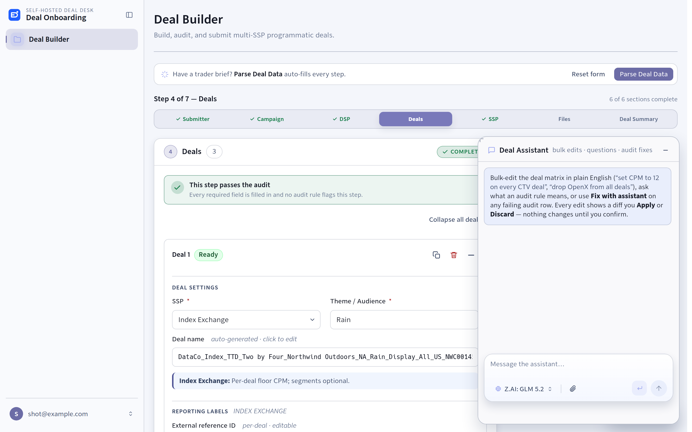
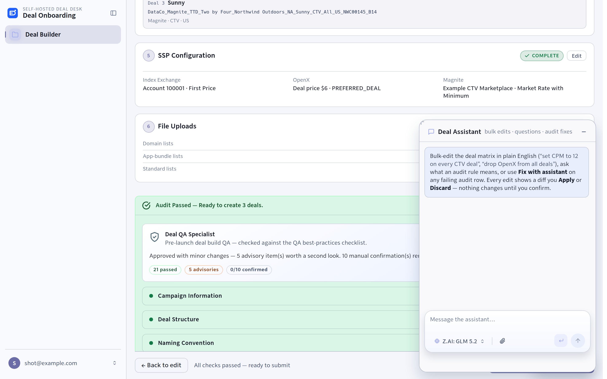

# Deal Onboarding

**A self-hosted deal desk you run yourself — intake a brief, audit the package,
book live deals across every exchange.**

Deal Onboarding is a single-tenant web app for programmatic curation teams. A
trader pastes or uploads a brief, the Deal Builder turns it into a structured,
SSP-aware batch, a deterministic audit (plus an optional AI QA pass) checks
every deal parameter, and one click hands the audited batch to your
[fleet](https://github.com/ElcanoTek/fleet) task runner, whose agent creates
the deals on Index Exchange, OpenX, PubMatic, Magnite, Xandr, Media.net, and
TripleLift and emails the deal sheet.



<details>
<summary>Deal Summary with the audit and QA report</summary>



</details>

- **Deal Builder** — campaign, DSP seats, SSP configuration, per-deal cards
  (audience, channel, geo, floors, IAB categories, viewability, publisher
  allowlists, domain/app-bundle lists), all with live deal-name previews.
- **Audit** — 25+ validation rules that mirror what each SSP will actually
  accept, a QA specialist report, and a server-side re-audit that gates every
  submit.
- **Deal Assistant** — a floating chat dock bound to the live form. Ask
  questions, or ask for bulk edits and review them as a diff before applying.
  Failing audit rows carry a "Fix with assistant" shortcut.
- **One outbound seam** — `POST /api/runner/create` sends a prompt, a
  structured brief, and the list files to your fleet task runner. Nothing
  else leaves the box.

## Quick start

Prerequisites: Go 1.24+, Node 18+.

```bash
cd frontend && npm install && cd ..
go mod tidy
cp .env.example .env            # set DEAL_ONBOARDING_SESSION_SECRET, ORG_NAME, CAMPAIGN_ID_PREFIX
go build -o bin/deal-onboarding-admin ./cmd/deal-onboarding-admin
DEAL_ONBOARDING_USER_STORE=./data/users.json ./bin/deal-onboarding-admin user add you@example.com
make dev                        # Go API on :8080, Vite on :5173
```

Open `http://localhost:5173/login`, sign in with the one-time password the
admin CLI printed, and start with `/help`.

Without an OpenRouter key the app still builds, audits, and submits deals; the
LLM features (Parse Deal Data, AI audit, Deal Assistant) return a clear
"not configured" note. Without a runner configured, the Create button explains
that submission is off and the prompt can still be copied.

## Configuration

Everything is environment-driven; `.env.example` is the annotated catalog.
The operator identity settings decide how deal names and campaign ids look:

| Variable | Default | Purpose |
|---|---|---|
| `ORG_NAME` | `Curator` | Slot 1 of every generated deal name when no data partner is set |
| `CAMPAIGN_ID_PREFIX` | `DEAL` | Campaign ids must match `<PREFIX>#####` |
| `DEFAULT_ATTRIBUTION_CODE` | `A1` | Slot 12 default |
| `RUNNER_PERSONA` | *(blank)* | Persona name your runner bundle defines, if any |

See [`docs/DEAL_NAMING.md`](docs/DEAL_NAMING.md) for the naming convention and
[`docs/ARCHITECTURE.md`](docs/ARCHITECTURE.md) for the runner seam.

## Documentation

- [`AGENTS.md`](AGENTS.md) — developer guide: layout, build, validation rules,
  design system.
- [`docs/ARCHITECTURE.md`](docs/ARCHITECTURE.md) — the outbound runner
  contract and the invariants around it.
- [`docs/DEAL_NAMING.md`](docs/DEAL_NAMING.md) — the 12-slot deal-name spec.
- [`docs/PUBLISHER_ALLOWLISTS.md`](docs/PUBLISHER_ALLOWLISTS.md),
  [`docs/ENVIRONMENT_TARGETING.md`](docs/ENVIRONMENT_TARGETING.md),
  [`docs/RETENTION.md`](docs/RETENTION.md).
- [`docs/LICENSING.md`](docs/LICENSING.md) — what the licence lets you do.

## Deployment

Single host, Fedora/RHEL-family:

```bash
sudo dnf install -y git
sudo git clone https://github.com/ElcanoTek/deal-onboarding.git /opt/deal-onboarding-src
sudo bash /opt/deal-onboarding-src/scripts/bootstrap.sh
```

The bootstrap installs dependencies, builds the Go server and the Vite bundle,
installs a `deal-onboarding` operator CLI and systemd unit, provisions initial
users, and optionally fronts the app with Caddy (Let's Encrypt or
`tls internal`). Afterwards:

```bash
deal-onboarding user add alice@example.com
deal-onboarding env edit        # set RUNNER_BASE_URL / RUNNER_API_KEY, OPENROUTER_API_KEY
deal-onboarding env check
deal-onboarding restart
deal-onboarding logs
deal-onboarding update          # git pull + rebuild + restart
```

Back up `DATA_DIR` (users, uploads, standard lists, audit log) on your own
schedule; see [`docs/RETENTION.md`](docs/RETENTION.md).

## Connecting a runner

Deal Onboarding talks to exactly one thing: a fleet deployment's task API.

1. In fleet, create a **scoped `create_task` key** for this app (it also
   authorizes uploads). Never hand the app an admin key.
2. Make sure the fleet bundle catalogs the MCP servers the prompts route to
   (`indexexchange_mcp`, `openx_mcp`, `pubmatic_mcp`, `magnite_mcp`,
   `xandr_mcp`, `medianet_mcp`, `triplelift_mcp`, `deal_sheet`, `sendgrid`) and,
   if you use one, the persona named in `RUNNER_PERSONA`.
3. Set `RUNNER_BASE_URL` (bare origin, no path) and `RUNNER_API_KEY`, restart,
   and press **Test connection** in the submit dialog: it checks `/api-info`
   reachability and whether the key clears the create gate, without creating
   a task.
4. Optionally configure `RUNNER_DEV_*` for a second deployment; the submit
   dialog then shows an environment picker. A dev runner with live SSP
   credentials books live deals.

Pin your engine and fleet revisions with the contract checkers so a tool
rename upstream fails CI here instead of failing a live batch:

```bash
node scripts/check-cutlass-contract.mjs /path/to/engine
node scripts/check-fleet-contract.mjs /path/to/fleet [/path/to/bundle]
```

## Repository practices

- **CI** (`.github/workflows/ci.yml`) runs on every push and PR: gofmt, `go
  vet`, `go test -race`, the frontend typecheck/tests/build, shell and checker
  syntax, and fixture parsing. Keep it green; never skip a test to get there.
- **Contract checks** (`.github/workflows/contract.yml`) run on demand against
  the engine and fleet repositories you name as inputs, with an optional
  `ENGINE_READ_TOKEN` secret for private repos. Run them before upgrading the
  runner and after any prompt-builder change.
- **CodeQL** (`.github/workflows/codeql.yml`) scans Go and TypeScript on push,
  PR, and weekly.
- **Dependabot** (`.github/dependabot.yml`) opens grouped weekly PRs for Go
  modules, npm packages, and GitHub Actions. Review anything touching the
  upload path, the session cookie, or the runner client before merging.
- **Branch protection** we recommend on `main`: require the CI and CodeQL
  checks, require one review, disallow force pushes, and squash-merge.
- **Secrets** live only in `.env` on the host (mode `0600`, owned by the
  service user) and in GitHub Actions secrets. `.gitignore` refuses every
  `.env*` variant except `.env.example`; keep it that way.
- **Releases**: tag `vX.Y.Z` on `main`, and note prompt/contract changes in the
  tag message so operators know to re-run the contract checkers before
  upgrading. `deal-onboarding update` fast-forwards a host to the tracked
  branch.
- See [`CONTRIBUTING.md`](CONTRIBUTING.md) and [`SECURITY.md`](SECURITY.md).

## License

Deal Onboarding is licensed under the **Business Source License 1.1**. You may
read, modify, and use it in non-production settings today; production use
requires a commercial licence until the Change Date (**2028-09-02**), after
which this version becomes available under the MIT License. Details in
[`LICENSE`](LICENSE) and [`docs/LICENSING.md`](docs/LICENSING.md); enquiries to
licensing@elcanotek.com.
